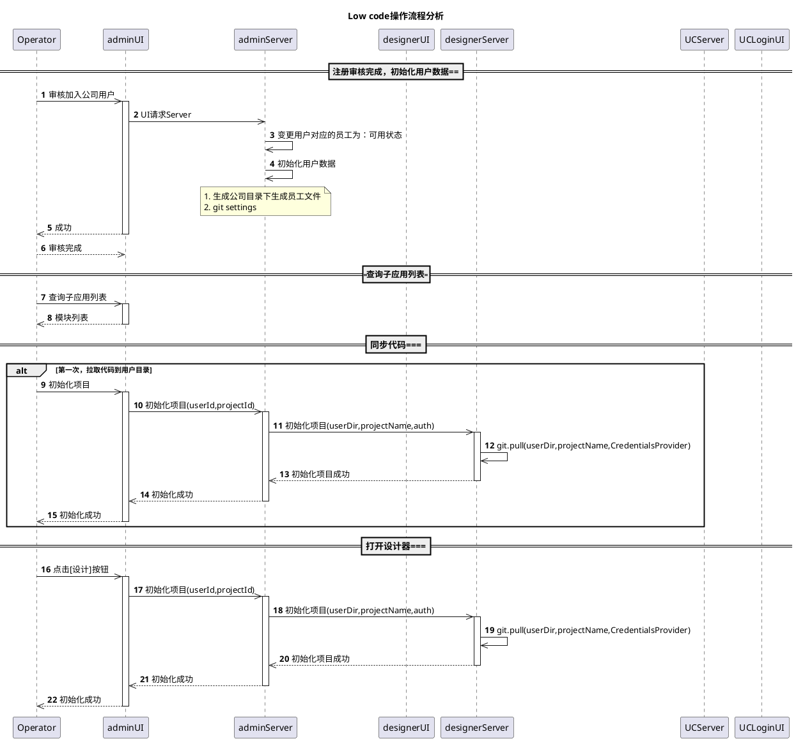

low code 操作流程分析

```plantuml
@startuml
title Low code操作流程分析
autonumber
participant Operator 
participant adminUI
participant adminServer
participant designerUI
participant designerServer
participant UCServer
participant UCLoginUI 
==注册审核完成，初始化用户数据====
Operator->> adminUI++: 审核加入公司用户
	adminUI->>adminServer:UI请求Server
		adminServer->>adminServer:变更用户对应的员工为：可用状态
		adminServer->>adminServer:初始化用户数据
		note over adminServer
			1. 生成公司目录下生成员工文件
			2. git settings
		end note
	return 成功
return 审核完成
====查询子应用列表====
Operator->>adminUI++: 查询子应用列表
return 模块列表 
=====同步代码=====
alt 第一次，拉取代码到用户目录
	Operator->>adminUI++: 初始化项目
		adminUI->>adminServer++: 初始化项目(userId,projectId)
			adminServer->>designerServer++:  初始化项目(userDir,projectName,auth)
				designerServer->>designerServer:  git.pull(userDir,projectName,CredentialsProvider)
			return 初始化项目成功
		return 初始化成功
	return 初始化成功
end alt
=====打开设计器=====
Operator->>adminUI++: 点击[设计]按钮
		adminUI->>adminServer++: 初始化项目(userId,projectId)
			adminServer->>designerServer++:  初始化项目(userDir,projectName,auth)
				designerServer->>designerServer:  git.pull(userDir,projectName,CredentialsProvider)
			return 初始化项目成功
		return 初始化成功
	return 初始化成功
@enduml
```
